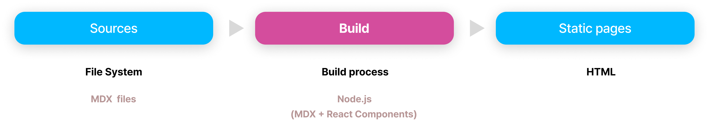
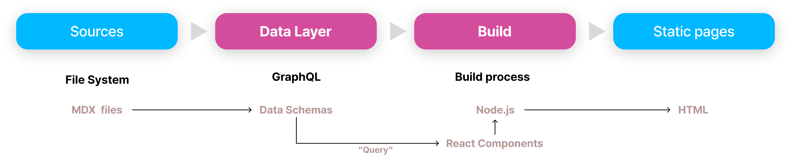
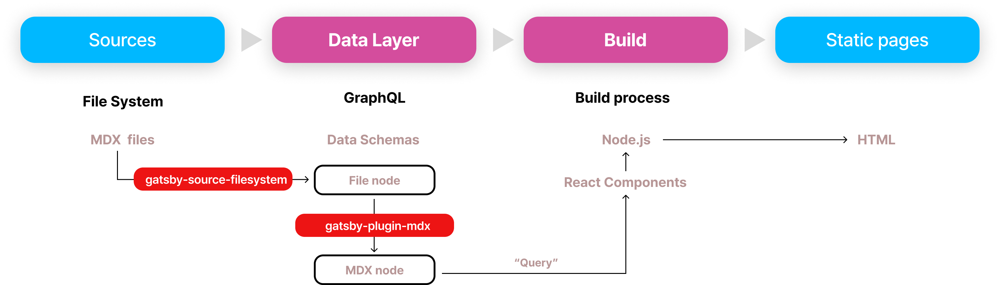

Gatsby 는 JAM Stack을 기반으로 한 대표적인 Static Site Generator 중 하나이다.

JAM Stack 은 JavaScript, API 그리고 Markup 으로 구성된 웹사이트를 구성하는 방법이라고 할 수 있다.
JAM Stack 에서 정의한 각자의 역할은 다음과 같다. (참고 : [https://jamstack.wtf/](https://jamstack.wtf/))

- **JavaScript** - Client의 모든 처리는 Javascript 가 실행 한다.
- **API** - 모든 기능이나 비즈니스 로직은 재사용 가능한 API 로 추상화 한다.
- **Markup** - SSG (Static Site Generator) 나 Template Engine (Webpack 등) 을 이용하여 미리 생성한 HTML Markup 이라 할 수 있다.

WordPress, Drupal 또는 Ghost 와 같은 블로그 플랫폼은 컨텐츠를 Database 에 저장하는 반면에, JAM Stack 은 웹사이트를 구성하는 모든 화면을 미리 Static 페이지인 Markup 으로 만들어 두는 것이 특징이다.
이를 Static Site Generator (줄여서 SSG 라고 쓰지만, '쓱' 이라고 발음하지는 말자) 라고 한다.

> 사실 Gatsby 는 Static Site Generator (SSG) 이기만 한것은 아니다. **Deferred Static Generation (DSG)** 이나 **Server-side Rendering (SSR)** 모두 기능을 제공하기 때문이다.
>
> Deferred Static Generation (DSG) 는 On Demand Static Generation 이라고 할 수 있으며, 사용자가 많이 접속하는 페이지만 Static 페이지로 생성하고, 그외에는 요청을 받았을 때 생성하는 방식이다.
> 블로그를 예를 들자면, 최근 100개의 post 만 미리 Static 페이지로 생성할 수 있을 것이다. 블로그 사이트 뿐 아니라, 다양한 서비스에 실제 많이 활용하고 있는 방법 중 하나이다.
>
> SSG 는 웹사이트를 구성하는 모든 페이지가 Static Markup 으로 생성 되기 때문에 서버 구성 없이 CDN 이나 S3 + CloudFront 에 배포만 해서도 동작 하겠지만,
> DSG 또는 SSG 는 반드시 서버(Gatsby 프레임워크에서 제공하는 Node.js 서버)를 실행해야만 한다.

JAM Stack 은 Front-end 개발 영역의 다양한 언어와 프레임워크의 조합으로 최신의 기술 요소들의 집합체로,
JAM Stack 기술 공유를 위한 컨퍼런스나 커뮤니티도 다수 존재하고 수 많은 Front-end 개발자들이 관심을 갖고 있는 분야이다.

물론 Gatsby 이외에도 다양한 JAM Stack 기반의 Static Site Generator 들이 있다.
[Jekyll](https://jekyllrb.com/) (ruby) 이 있고, [Hugo](https://gohugo.io/) (go), [Nuxt](https://nuxtjs.org/) (vue), [Next](https://nextjs.org/) (react) 등 다양하다.

## 왜 Gatsby 로 블로그를 만들게 되었나?

---

이전에는 [Jekyll](https://jekyllrb.com/) 을 사용해 웹사이트를 만들어 운영해 본 경험이 있다.

Jekyll 은 아주 간단히 설정만 추가하고, Template 과 Layout 페이지를 개발한 다음 Markdown 파일에 글을 작성하면 블로그 사이트가 완성되고, Github Pages 로 Hosting 할 수 있는 아주 매력적인 SSG 이다.
심지어는, Jekyll은 Ruby 로 개발된 SSG 임에도 불구하고 Ruby 를 전혀 모르고 있다고 해도 웹사이트를 생성하는데 전혀 문제가 되지 않는다.

그런데 왜 Gatsby 를 사용해서 기술 블로그를 만들고자 했을까? 바로 아래와 같은 Gatsby 의 특징 때문이다.

### 1. React, Node.js

Gatsby는 화면 랜더링은 React 기반으로 동작하며, 설정 부터 개발과 빌드 프로세스는 Node.js 환경에서 동작한다.

일반적인 Static Site Generation 과정은 위의 그림과 같다.

Markdown 또는 MDX (Markdown 파일 안에서 React Component 를 사용할 수 있음)로 작성된 블로그 포스트를 Build 과정을 통해 React Component 로 조합 하여 HTML Markup 으로 변환 하는 과정이다. 이 과정은 Jekyll 과 같은 다른 Static Site Generator 와 거의 유사하다.

과거 Jekyll 을 사용하면서, Ruby 언어 경험이 부족하여 내부 동적하는 소스를 이해 하기 쉽지 않아 간혹 원인을 알기 어려운 에러를 보게 되는 경우가 있었다.
게다가, Ruby 로 개발된 프레임워크를 사용하는데, Ruby 코드를 사용할 일이 거의 없다는 것이 내심 불편하기도 했다.
그리고 Jekyll 과 Ruby 환경은 Mac 과 Windows 에서 서로 동일하게 동작하지 않는 경우도 많았다.

Node.js 환경을 기반으로한 Gatsby 는 Ruby 에 비하여 상대적으로 다양한 OS 에 일관적인 개발 환경을 제공한다고 생각한다. (물론 내가 Ruby 경험이 부족해서일 것이다)
그리고 React 기반의 UI 개발 환경에서는 이미 개발되어 있는 다양한 React Component를 블로그 시스템에도 사용할 수 있을 것이다.
무엇 보다도, Node.js 기반 환경과 React 에 익숙하거나, React 를 열심히 학습하고 있는 중이라면, 블로그 시스템을 운영하면서 사용해 볼 수 있으니 그야말로 일석이조 아닌가 생각한다.

한번도 사용해본 경험이 없는 사람은 있어도, 한번도 사용하지 않은 사람은 있어도 한번만 사용한 사람은 없다는 TypeScript도 장점이겠다.
Gatsby 는 프로젝트를 생성할 때 TypeScript 기반으로 개발을 시작할 수 있는 환경셋팅을 제공하고, Type Definition 도 잘 정의 되어 있기 때문에, TypeScript 로 개발하기에도 어려움이 없다.

### 2. GraphQL

Gatsby의 Data Layer 를 담당하고 있는 GraphQL도 큰 장점 중 하나가 될 수 있다.

GraphQL의 장점을 설명하기 위해 일반적인 Remote Rest API 를 사용하여 데이터를 조회 할 때 발생할 수 있는 이슈 두가지를 먼저 알아보자.

- Over-fetching : API는 원하는 데이터보다 더많은 데이터를 가져와야 하는 경우가 많다. Client 에서 원하는 데이터만 조회 하려면, API 가 많아질것이고 상당히 많은 부분이 중복 개발 되어야 할 수 있다.
- Under-fetching : 여러번의 요청을 해야하는상황이 나오기도 한다. 블로그 Post 페이지를 예를 들자면, Post 본문을 가져오는 API 와 Comment 목록을 가져오는 API 를 각각 호출해서 화면에서 조합해야 할 것이다.

위의 두가지 문제는 Client 의 요구사항에 맞게 개발하면 해결할 수 있는 문제겠지만, 계속해서 기민하게 수정되어야 하는 서비스인 경우 개발자가 수정해야 하는 비용을 클 수밖에 없고, 복잡도는 계속 증가하게 될 것이다.

GraphQL의 주요한 특징으로, 필요한 데이터만 받아올 수 있다는 점과 한 번에 필요한 데이터를 모두 요청할 수 있다는 점이다.

그런데, 왜 Static Page Generator인 Gatsby 에서 GraphQL 을 사용하는 것인가?

Static Page Generation(SSG) 에서는 GraphQL 를 Remote API 서버로 사용하지 않고, 데이터를 조회하여 Static Page 를 생성하하는데 사용한다

만약 Deferred Static Generation (DSG)이나 Server-side Rendering (SSR) 인 경우는 Remote API 로 Query 가 실행될 것이다. 이 블로그 프로젝트에서는 SSG 로 구현한 것으로, 빌드 하는 과정에서의 Over Fetching 이나 Under Fetching 을 해결하는 것으로 실질적인 효과가 크지 않겠지만, 개발자의 생산성에는 도움이 될 것이다.

블로그 사이트 정보, 이미지 파일들 그리고 블로그 글을 작성한 Markdown 파일의 정보 부터 Markdown 파일안에 작성된 Frontmatter 정보와 본문 내용, ToC 정보 등을 GraphQL 로 Query 할 수 있으며, 개발자는 필요한 정보를 가져와 Static Page 를 생성하게 할 수 있다.

Swagger 와 같이 API Specification 과 Rest API 테스트를 위한 기능을 제공하는 [GraphiQL](https://github.com/graphql/graphiql)이라는 GraphQL IDE 도 있으며, 이를 통해 Query 를 실행하고, Schema 탐색을 할 수 있다.

### 3. Gatsby API

Jekyll 은 설정 파일의 값을 변경하여 쉽고 간편하게 블로그 시스템을 구축할 수 있다만, 설정값에 따라 내부 동작하는 로직을 이해하지 못한 상태에서는 **Magic - _"어떻게 동작하는지는 모르지만, 잘 동작한다."_** 일 뿐이다.
엔지니어가 항상 두려워 하는 것이 바로 이 Magic 아닌가? 항상 기대하는 대로 정상 동작한다면, 마음은 불편하더라도 목적은 달성할 수 있겠다지만, 원하는 결과물을 보지 못한다면, 설정값을 이것 저것 수정해 보는 수 밖에 없겠다.

Gatsby 는 개발, 빌드하는 거의 모든 과정에서 [Gatsby API](https://www.gatsbyjs.com/docs/reference/config-files/gatsby-node/) 를 제공하고 있어서 GraphQL 기반의 Data 스키마를 개발자가 원하는 대로 구성하거나, 다양한 기능들을 구현해 넣을 수 있다.
블로그라면, 기본적인 Tags나 Categories 으로 컨텐츠 분류하고, 연재글을 모아 볼 수 있는 Series 기능도 구현해 볼 수도 있겠다. 본 블로그는 초기에 컨텐츠 양이 그렇게 크지 않을 것이기에, 우선 Tags 정도만 구현해 놓을 계획이고, 향후 기능을 더 추가해 보도록 하겠다.

### 4. Plugins

Gatsby 는 다양한 plugin들을 추가하여 기능을 확장 할 수 있다.

블로그 프로젝트에서 사용한 Plugin 중 대표적인 두가지가 어떤 역할을 하는지에 대하여 아래 Flow 를 작성해 보았다.

`gatsby-source-filesystem` 은 지정한 디렉토리의 모든 파일을 가져와 `File` 이라는 GraphQL Schema 에 데이터를 생성한다.

`gatsby-plugin-mdx` 는 `MDX` 이라는 GraphQL Schema 생성하고 `File` 목록 중 mdx 파일을 읽어와 Frontmatter 정보, 본문 내용, ToC(Table of Contents) 정보 등의 데이터를 생성하여 저장한다.

이 블로그 프로젝트에서 사용하고 있는 plugin 중 주요한 몇가지는 아래와 같다.

- [gatsby-plugin-mdx](https://www.gatsbyjs.com/plugins/gatsby-plugin-mdx/) : MDX를 기반으로 Markdown 파일 내에 JSX를 작성해서 리액트 컴포넌트를 표현할 수 있다.
- [gatsby-source-filesystem](https://www.gatsbyjs.com/plugins/gatsby-source-filesystem/) : 컨텐츠를 지정한 파일 디렉토리에서 읽어와 페이지를 구성한다. 만약 Headless CMS 를 사용하거나 외부 SaaS 를 사용하는 경우, 적합한 plugin 을 선택해 설치하거나 개발해야 할 것이다.
- [gatsby-plugin-sitemap](https://www.gatsbyjs.com/plugins/gatsby-plugin-sitemap/) : Sitemap 을 자동 생성해 준다.
  기본적으로 Sitemap은 모든 웹사이트 페이지들의 위치와 정보를 생성하게 되는데, 검색엔진이 웹사이트를 수집하는데 도움을 준다.
  이 Plugin은 Production 모드로 빌드 될때만 동작한다.
- [gatsby-plugin-manifest](https://www.gatsbyjs.com/plugins/gatsby-plugin-manifest/) : PWA 스펙의 일부분으로, 홈스크린에 사이트를 추가 할 수 있도록 하기 위한 manifest 설정 파일을 만들어 준다.
  그외에도 icon 이나 localization 을 위한 기능도 제공하고 있어 대부분의 Gatsby 기반 프로젝트에서 사용 중이다.
- [gatsby-plugin-image](https://www.gatsbyjs.com/plugins/gatsby-plugin-image/), [gatsby-plugin-sharp](https://www.gatsbyjs.com/plugins/gatsby-plugin-sharp/) : 이미지 파일 최적화를 통해 품질 높은 이미지로 재생성하고 화면에 빠르게 로딩 될 수 있다.

이외에도, SEO, RSS, Google Analytics 등 다양한 Plugin 을 [Gatsby plugin 검색 사이트](https://www.gatsbyjs.com/plugins)에서 찾을 수 있다.

기능의 일부를 별도의 plugin 을 개발하여 공통 기능을 재사용 가능한 모듈화 또는 라이브러리와 하는건 소프트웨어 개발 및 유지 관리하는데 상당한 효율적인 방법 중 하나이다.
그리고, 개발자가 얼마나 쉽게 plugin 을 개발할 수 있는지도 프레임워크를 선택하는데 중요한 기준 중 하나일 것이다.

Node.js 경험이 있는 개발자라면 아래 가이드 링크를 통해 어렵지 않게 Plugin을 직접 개발할 수 있다.

- [How to Create Plugins](https://www.gatsbyjs.com/docs/creating-plugins/)
- [How to Create a Local Plugin](https://www.gatsbyjs.com/docs/creating-a-local-plugin/) : 로컬에 Plugin 을 개발하여 기능을 재사용한 가능한 모듈로 만드는 방법

### 5. Documentation

개발하는데 Tutorial 이나 참조 문서가 얼마나 풍부한지 역시 프레임워크 선택을 위해 반드시 고민해봐야 하는 부분이다.

Gatsby에서 제공하는 [Gatsby Documentation](https://www.gatsbyjs.com/docs) 에는 설치 및 설정 부터 빌드, 배포까지 상당히 상세히 정리되어 있다.
굳이 다른 개발자가 정리해 공유한 컨텐츠를 찾아볼 필요가 전혀 없을 정도라고 생각한다.

### 6. Headless CMS

이 블로그 프로젝트는, `gatsby-source-filesystem` Plugin 을 이용한 방법으로 파일을 데이터소스로 사용하고 있다.

Gatsby 는 다양한 CMS(Contents Management System) 와 연결할 수도 있다. 예를들어 [WordPress](https://wordpress.org/) 나 [Ghost](https://ghost.org/) 등 CMS 의 컨텐츠를 API 통해 가져와 Gatsby 의 GraphQL 기반의 Data Layer 에서 사용할 수 있는 Plugin 도 제공된다.
심지어 Shopify 와 같은 Commerce platform 의 API 를 사용할 수도 있으며, 그외에도 다양한 Headless CMS 와의 연동을 구현할 수 있다.

> Headless 란 '머리가 없다' 라는 단어인데, 그럼 머리는 무엇을 말하는가?
>
> Headless CMS 를 이야기 해보자면, CMS 를 Data 영역과 화면 UI 영역으로 나누어 볼때 '머리'는 바로 랜더링 되는 UI 인 것이다. UI 가 없는 대신, API 를 제공하게 된다.
> 즉, '머리' 역할을 하는 UI Layer 대신 API Layer 를 두고, Gatsby는 이 API 를 사용하여 블로그 시스템을 구현하게 된다.

이 블로그 시스템은 Markdown 파일로 작성한 파일을 기반으로 동작하기만 해도 충분하기에 Headless CMS 를 사용하지는 않았다.
개인 블로그가 아닌 경우라면, 컨텐츠 규모와 현재 운영 중인 프로세스 및 시스템 상황에 맞게 적용을 고민해 볼 문제이다.

## 결론

---

Gatsby 는 JAM Stack 아키텍처를 기반으로 한 대표적인 **Static Site Generator (SSG)** 중 하나이면서,
**Deferred Static Generation (DSG)** 와 **Server-side Rendering (SSR)** 모두 지원한다.

Gatsby 는 UI 랜더링을 위해 React 를 사용하고, Data 를 관리하기 위한 Data Layer 에서는 GraphQL 을 사용한다. 그리고 개발 및 배포는 모두 Node.js 를 기반으로 하고 있다.

내가 Gatsby 를 기술 블로그 프레임워크로 사용한 몇가지 이유는,

- React 기반이라 React 경험자에게 익숙한 환경이며, 다양한 React Component 를 재사용할 수 있다.
- 다양한 Plugins 가 이미 제공되고 있고, 내가 직접 Plugin 을 만들어 모듈화 하기 용이 하다.
- Gatsby API 를 사용하여 내가 구현하고자 하는 기능을 얼마든지 구현할 수 있다.
- 문서화가 정말 잘되어 있어, 구글링까지 할 필요도 없어 보인다.

하지만, 분명히 단점도 있다.

당연히 React 를 잘 모른다면, React 부터, 아니 그 이전에 UI Declarative Programming 을 먼저 경험해봐야 할 것이다.
게다가 Gatsby 가 동작하고 빌드되는 과정에 대한 이해가 반드시 필요하다. 이부분은 다음 글에서 차근차근 살펴보자.

그럼 이제 [Gatsby Tutorial : Learn how Getsby works](https://www.gatsbyjs.com/docs/tutorial/) 를 보면서 따라해봅시다. 어렵지 않게 Gatsby 의 대부분의 기능을 경험하고 배울 수 있을 것이다.

### 참고

---

- [https://jamstack.org/](https://jamstack.org/)
- [https://www.gatsbyjs.com/](https://www.gatsbyjs.com/)
